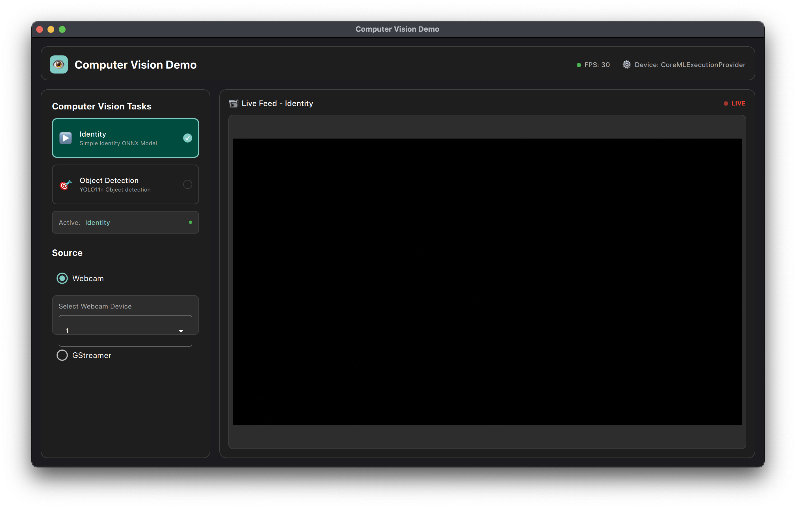
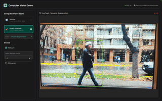

# Vision Demo



Simple vision demo with GUI.

## Goals

- [x] Create nice GUI with easy plug and play components
- [x] Simple off the shelf ONNX model
- [x] GUI must connect with embedded over network and local webcam(s)
- [x] Example with embedded over network

## Installation

```
pip install -r requirements.txt
```

> **_NOTE:_** To use the GStreamer with OpenCV, you have to install the gstreamer enabled OpenCV with Python. I've left this as an extra step if you are inclined. OpenCV Gstreamer help:
    [MacOS](https://gist.github.com/liviaerxin/6ee3d4faea1614572e621d81d0e114c8)
    [Linux](https://github.com/opencv/opencv-python/issues/530).

## run

```bash
python main.py
```

## Examples

### RPI and Pointgrey


This is an embedded application. We use our own C++ code which utilizes gstreamer.

To install the hardware and code, see [camera_module](./camera_module/README.md)

```bash
./Main port host
```
i.e
```bash
./Main 192.268.xx 5000
```

To receive frames in GUI:
```bash
udpsrc port=5000 caps="application/x-rtp, media=(string)video, encoding-name=(string)H264, payload=96, clock-rate=90000" ! rtph264depay ! avdec_h264 ! videoconvert ! video/x-raw,format=BGR ! appsink
```

### Iphone 12 Mini



As a fun example, the MacOS OpenCV easily connects with the Iphone as a continuity cameras.

This is an example video shot with Iphone.

(Slow framerate and bad quality as it's a GIF, promise it's 1080p 30 FPS :sweat:)

## Extending

### Model

As an example I've used YOLO 11n, which I generated using Ultralytics with:

```bash
yolo export model=yolo11n.pt format=onnx
```

If you want to add a model:

1. Add model in the QML:

```qml
model: [
    {icon: "▶️", name: "Identity", desc: "Simple Identity ONNX Model"},
    {icon: "️🎯", name: "Object Detection", desc: "YOLO11n Object detection"}
]

```

2. Add inference class (here's a simple identity one)
```python
class IdentityInference(BaseInference):
    def __init__(self, device):
        self.device = device
        self.session = ort.InferenceSession('models/identity.onnx', providers=self.device)
        self.input_name = self.session.get_inputs()[0].name
        self.output_name = self.session.get_outputs()[0].name
    
    def run(self, frame: np.ndarray):
        # Ensure float32 and memory contiguity
        frame = np.ascontiguousarray(frame).astype(np.float32)

        # Run inference
        result = self.session.run([self.output_name], {self.input_name: frame})[0]

        return to_uint8_image(result)
```

3. Add switch to `set_inference_runner`

```python
    @Slot(str)
    def set_inference_runner(self, runner_string: str):
        if runner_string == "Identity":
            self.inference_runner = IdentityInference(device=self.device)
        elif runner_string == "Object Detection":
            self.inference_runner = Yolo11n(device=self.device)
        else:
            warnings.warn(f"No inference with name: {runner_string}")
```


### Source Video

To add a video source:

1. Add option to QML

```qml
...
RadioButton {
    id: new_webcam 
    text: "new_webcam"
    checked: true
    ButtonGroup.group: sourceGroup
    Material.accent: accentColor
    onToggled: if (checked) controller.on_frame_provider_selected({type: "new_webcam"})
}
```

2. Implement a new provider (doesn't have to be OpenCV)

```python
class Provider(ABC):
    """Base class for a provider"""
    def get_frame(self): raise NotImplementedError()
    def close(self): raise NotImplementedError()


class NewWebcamProvider(Provider):
    """Simple on device webcam provider"""

    def __init__(self, index: int = 0):
        self.index = index
        self.cap = cv2.VideoCapture(index)

    def get_frame(self):
        ret, frame = self.cap.read()
        if ret:
            frame = cv2.cvtColor(frame, cv2.COLOR_BGR2RGB)
        return ret, frame
    
    def close(self):
        self.cap.release()
```

3. Add switch to frame_receie

```python
@Slot("QVariantMap")
def set_provider(self, config: dict):
    # stop timer whilst provider switching
    if self.timer:
        self.timer.stop()

    provider_type = config.get("type")
    print(f"[FrameReceiver] Config received: {config}")

    # Stop and clean up existing provider if any
    if self.provider:
        try:
            self.provider.close()
        except Exception as e:
            print(f"Error closing provider: {e}")

    if provider_type == "webcam":
        index = int(config.get("device_index", 0))
        self.provider = WebcamProvider(index=index)

    #### like this
    elif provider_type == "new_webcam":
        self.provider = NewWebcamProvider()

    else:
        print(f"Unknown provider type: {provider_type}")
    
    # start timer again
    if self.timer:
        self.timer.start()

```